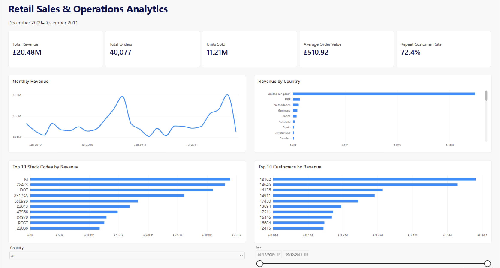

# Retail Sales & Operations Analytics

I built this project to get more experience working with a larger real-world dataset and to practice taking a data project from the raw files all the way to a finished dashboard.

I used the UCI Online Retail II dataset, which has over one million transaction lines from a UK-based online retailer between December 2009 and December 2011.

I used Python and pandas to clean the data, DuckDB and SQL to organize and analyze it, and Power BI to build an interactive dashboard. I also added tests and validation checks throughout the project because I wanted to make sure the numbers in the final dashboard actually matched the data behind them.

## Demo

[Watch the Power BI dashboard walkthrough](YOUR_VIDEO_LINK_HERE)

In the video, I go through the main parts of the dashboard and show how the date and country filters change the results.



The actual Power BI file is also included in the project:

[Download the Power BI report](powerbi/Retail_Sales_Operations_Analytics.pbix)

## What It Analyzes

I focused on a few main areas:

- overall revenue and orders
- monthly revenue trends
- sales by country
- top products by revenue
- top customers by revenue
- repeat customers
- how concentrated revenue is among the top customers and products

Some of the main results were:

- **£20.48M** in valid revenue
- **40,077** orders
- **11.21M** units sold
- **£510.92** average order value
- **5,878** identified customers
- **4,255** repeat customers
- **72.4%** repeat-customer rate
- **85.0%** of valid revenue came from the United Kingdom
- November 2011 was the highest-revenue complete month at about **£1.50M**

## How It Works

```text
UCI Online Retail II
        |
        v
Raw Excel Data
1,067,371 rows
        |
        v
Python + pandas
Cleaning and classification
        |
        v
Clean Staging Data
1,033,036 rows
        |
        v
DuckDB
Star Schema
        |
        +-------------------+
        |                   |
        v                   v
   fact_sales          Dimension Tables
1,007,913 rows      date / customer /
                    product / location
        |
        v
SQL Analysis
        |
        v
Validation + Testing
        |
        v
Power BI + DAX
        |
        v
Interactive Dashboard
```

The final sales table has one valid, de-duplicated invoice line per row.

## Tech Used

- **Python** - loading, cleaning, transforming, and validating the data
- **pandas** - working with the original Excel dataset
- **SQL** - analysis and data-quality checks
- **DuckDB** - storing the cleaned data and building the star schema
- **Power BI** - building the dashboard
- **DAX** - creating the dashboard measures
- **pytest** - automated testing

## Project Structure

```text
retail-sales-operations-analytics/
|
├── images/
|   └── retail_sales_dashboard.png
|
├── outputs/
|   ├── business_findings.md
|   ├── baseline_reconciliation.csv
|   ├── duckdb_validation_results.csv
|   ├── integrity_report.md
|   └── test_results.txt
|
├── powerbi/
|   └── Retail_Sales_Operations_Analytics.pbix
|
├── scripts/
|   ├── build_pipeline.py
|   ├── export_powerbi.py
|   ├── run_analysis.py
|   └── verify_project.py
|
├── sql/
|   ├── analysis/
|   ├── validation/
|   └── schema.sql
|
├── src/
|   ├── analysis.py
|   ├── clean.py
|   ├── database.py
|   ├── ingest.py
|   ├── model.py
|   ├── profile.py
|   └── validate.py
|
├── tests/
|
├── .gitignore
├── README.md
└── requirements.txt
```

The raw dataset, generated data files, virtual environment, and Python cache files are not included in the repository.

## A Few Design Choices

### Why I Used DuckDB

I wanted the whole project to be able to run locally, so I used DuckDB instead of setting up a cloud database.

It worked well for this project because I could use SQL on over one million transaction lines while still keeping the setup pretty simple.

### Star Schema

I separated the sales data into one fact table and four dimension tables:

```text
                 dim_date
                    |
                    |
dim_customer --- fact_sales --- dim_product
                    |
                    |
               dim_location
```

The final tables contain:

| Table | Rows |
|---|---:|
| `fact_sales` | 1,007,913 |
| `dim_date` | 739 |
| `dim_customer` | 5,879 |
| `dim_product` | 4,745 |
| `dim_location` | 43 |

I wanted to practice working with a structure that is commonly used for analytics instead of keeping everything in one large table.

It also made it easier to bring the same model into Power BI later.

### Cleaning the Transactions

Not every row in the original dataset represented a valid sale.

I classified records using statuses including:

```text
SALE
CANCELLATION
RETURN
MISSING_REQUIRED
INVALID_QUANTITY
INVALID_PRICE
```

I kept track of excluded records instead of just deleting them during cleaning. This made it easier to check why certain records were not included in the final sales table.

The original dataset had:

```text
1,067,371 rows
```

After removing exact duplicates, the staging data had:

```text
1,033,036 rows
```

The final fact table contained:

```text
1,007,913 valid sales rows
```

A total of **34,335 exact duplicate rows** were removed.

### Missing Customer IDs

Some valid transactions did not have a customer ID.

I didn't want to remove those transactions because that would also remove valid revenue. Instead, I mapped them to an unknown customer with a customer key of `0`.

For customer-specific analysis, like the Top 10 Customers chart, I exclude that unknown customer.

### Invoice Numbers

I treat invoice numbers as text because they are IDs, not values that should be added or averaged.

This was especially important when I brought the data into Power BI and used invoice numbers to count distinct orders.

### Checking the Numbers Before Building the Dashboard

Before building the Power BI dashboard, I calculated and validated the main metrics using Python and SQL.

That gave me a set of expected results that I could compare against Power BI later.

I found this useful because a dashboard can look correct even when something in the model or a measure is wrong.

## Power BI Dashboard

After finishing the data pipeline and SQL analysis, I exported five tables for Power BI:

```text
fact_sales
dim_date
dim_customer
dim_product
dim_location
```

I recreated the star schema in Power BI using four relationships:

```text
dim_customer  1 ---- *  fact_sales
dim_date      1 ---- *  fact_sales
dim_product   1 ---- *  fact_sales
dim_location  1 ---- *  fact_sales
```

The dashboard has five KPI cards:

- Total Revenue
- Total Orders
- Units Sold
- Average Order Value
- Repeat Customer Rate

I also added:

- Revenue by Month
- Revenue by Country
- Top 10 Products by Revenue
- Top 10 Customers by Revenue
- Date range slicer
- Country slicer

### DAX Measures

These are some of the measures I used in the dashboard.

```DAX
Total Revenue =
SUM(fact_sales[revenue])
```

```DAX
Total Orders =
DISTINCTCOUNT(fact_sales[invoice_no])
```

```DAX
Units Sold =
SUM(fact_sales[quantity])
```

```DAX
Average Order Value =
DIVIDE([Total Revenue], [Total Orders])
```

```DAX
Identified Customers =
CALCULATE(
    DISTINCTCOUNT(fact_sales[customer_key]),
    fact_sales[customer_key] <> 0
)
```

```DAX
Repeat Customers =
VAR IdentifiedCustomers =
    FILTER(
        VALUES(fact_sales[customer_key]),
        fact_sales[customer_key] <> 0
    )
RETURN
    COUNTROWS(
        FILTER(
            IdentifiedCustomers,
            CALCULATE(
                DISTINCTCOUNT(fact_sales[invoice_no])
            ) > 1
        )
    )
```

```DAX
Repeat Customer Rate =
DIVIDE([Repeat Customers], [Identified Customers])
```

The final Power BI results were:

```text
Total Revenue          £20,476,260.45
Total Orders           40,077
Units Sold             11,205,148
Average Order Value    £510.92
Identified Customers   5,878
Repeat Customers       4,255
Repeat Customer Rate   72.4%
```

I compared these values against my SQL results to make sure the dashboard was giving me the same numbers.

## A Few Findings

### Most Revenue Came From the UK

The United Kingdom generated:

```text
£17,410,196.12
```

That was about **85.0%** of all valid revenue in the dataset.

### Most Identified Customers Came Back

Out of **5,878** identified customers, **4,255** placed more than one order.

That gave me a repeat-customer rate of:

```text
72.4%
```

### November 2011 Was the Strongest Complete Month

November 2011 had:

```text
Revenue: £1,503,866.78
Orders:  2,769
```

This was the highest-revenue complete month in the data.

I treated December 2011 separately because the dataset only contains part of that month.

### Revenue Was Concentrated Among Some Customers and Products

The top 10 identified customers generated about **13.6%** of total valid revenue.

The top 10 stock codes generated about **10.3%** of total valid revenue.

## How to Run It on Another Computer

### 1. Clone the Repository

```bash
git clone <YOUR_REPOSITORY_URL>
cd retail-sales-operations-analytics
```

### 2. Create a Virtual Environment

```bash
python -m venv .venv
```

On Windows:

```bash
.venv\Scripts\activate
```

On macOS or Linux:

```bash
source .venv/bin/activate
```

### 3. Install the Requirements

```bash
pip install -r requirements.txt
```

### 4. Download the Dataset

The project uses the **Online Retail II** dataset from the UCI Machine Learning Repository:

https://archive.ics.uci.edu/dataset/502/online+retail+ii

The original file is:

```text
online_retail_II.xlsx
```

The raw dataset is not included in this repository.

### 5. Run the Project

The main scripts are:

```text
scripts/build_pipeline.py
scripts/run_analysis.py
scripts/export_powerbi.py
scripts/verify_project.py
```

They handle the main parts of the project:

```text
load the data
      ↓
clean the data
      ↓
build the database
      ↓
create the star schema
      ↓
run the SQL analysis
      ↓
validate the results
      ↓
export data for Power BI
```

### 6. Run the Tests

```bash
pytest
```

### 7. Open the Power BI Report

The finished Power BI file is here:

```text
powerbi/Retail_Sales_Operations_Analytics.pbix
```

It can be opened with Power BI Desktop.

Since the dashboard was built using locally exported files, the data-source paths may need to be changed before refreshing it on another computer.

## Testing

I added tests and validation checks because I wanted to catch problems before they reached the dashboard.

The final project passed:

```text
20 / 20 database validations
21 / 21 metric reconciliations
11 / 11 integrity checks
 9 / 9 automated tests
```

I checked things like:

- row counts
- duplicate handling
- missing values
- fact and dimension relationships
- revenue calculations
- order counts
- customer counts
- analysis results
- whether results stayed consistent between different parts of the project

I also compared the main SQL results with the final Power BI measures:

```text
Metric                 SQL / DuckDB       Power BI
------------------------------------------------------
Revenue                £20,476,260.45     £20,476,260.45
Orders                 40,077             40,077
Units                  11,205,148         11,205,148
Average Order Value    £510.92            £510.92
Identified Customers   5,878              5,878
Repeat Customers       4,255              4,255
Repeat Customer Rate   72.4%              72.4%
```

## What I Learned

This was my first project where I worked with over one million transaction lines and took the data all the way from the original Excel file to a finished Power BI dashboard.

I got more practice with:

- cleaning larger datasets with pandas
- writing SQL for analysis
- designing a star schema
- working with DuckDB
- handling missing and invalid data
- checking data quality
- writing automated tests
- comparing results between different parts of a pipeline
- creating DAX measures
- building a Power BI dashboard
- turning the analysis into visuals that are easier to understand

The biggest thing I took away from the project was the importance of checking the numbers at each step.

It was useful to have the Python and SQL results already validated before I started working in Power BI because I had something to compare the dashboard against instead of just assuming the final numbers were right.

## Current Limitations

There are still a few things I would keep in mind with this project:

- The data comes from one retailer, so it doesn't represent the whole retail industry.
- Some transactions are missing customer IDs, which limits some customer analysis.
- The dataset is from 2009 to 2011, so it doesn't represent current retail behaviour.
- December 2011 is incomplete, so I don't compare it directly with complete months.
- The product information is limited, so there isn't much room for category-level analysis.
- The Power BI report is built as a local portfolio project rather than a production dashboard.

## Possible Next Steps

If I continue working on the project, some things I would like to try are:

- customer segmentation
- cohort analysis
- retention analysis
- year-over-year comparisons
- more product-level analysis
- deeper analysis of returns and cancellations
- automated dashboard refreshes
- sales forecasting